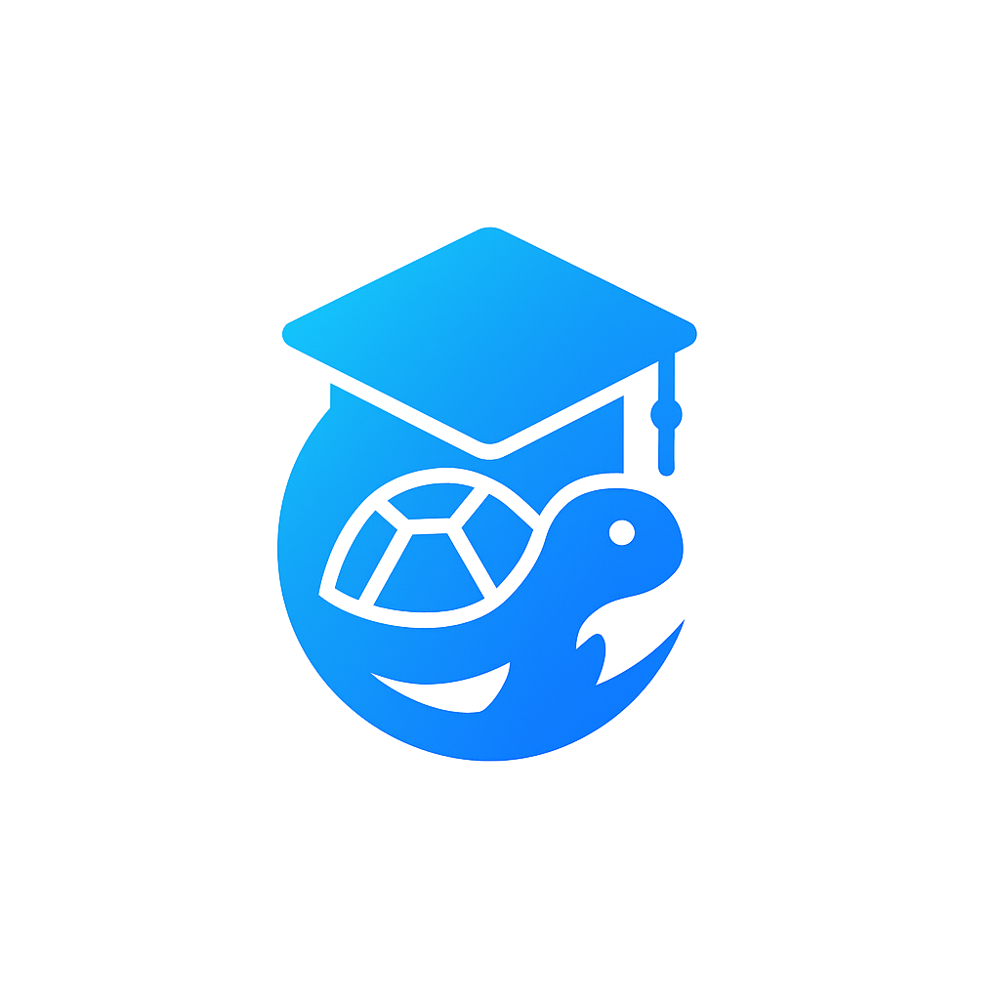

<h1 align="center">
  GoLearnix
</h1>

<p align="center">
  
</p>

<br>


<p align="center">
  
  
  
  
  
  
</p>


<br>

## 📚 Resumen
GoLearnix es una plataforma de microservicios, que surge como proyecto educativo, diseñada para acompañar todo el ciclo de vida de los cursos online, desde su modelado y administración hasta la inscripción, seguimiento y evaluación de los alumnos. Distribuida en dos stacks especializados, un microservicio en Go (Fiber) para la autenticación, autorización y gestión de usuarios, y otro en Java/Spring Boot dedicado a la lógica de cursos, GoLearnix integra un almacén relacional (PostgreSQL) para datos transaccionales, un repositorio en memoria de alta velocidad (Redis OM Spring) para consultas ágiles y un sistema de mensajería asíncrona (RabbitMQ) que orquesta flujos de negocio de manera desacoplada y resiliente.

El corazón de la solución se basa en una **Arquitectura Hexagonal** y un modelo **por capas**, que aíslan rigurosamente la lógica de dominio de la infraestructura, garantizando independencia tecnológica y máxima adaptabilidad. Los **puertos** definen contratos estables y los **adaptadores** conectan el dominio con REST, eventos o bases de datos, lo que facilita la incorporación de nuevos canales o cambios de tecnología sin alterar las reglas de negocio. Asimismo, la adopción de **Domain-Driven Design** ha permitido estructurar entidades, agregados y servicios en torno a conceptos reales del negocio, reforzando la claridad y cohesión del código.

Para resolver la necesidad de **consistencia eventual** entre PostgreSQL y Redis, se ha implementado un **patrón Saga** basado en eventos internos de Spring, con mecanismos compensatorios que garantizan la integridad de los datos ante fallos parciales. La **abstracción de persistencia** se realiza a través del patrón **Repository**, mientras que los **Assemblers** centralizan el mapeo de objetos y la resolución de dependencias simples, promoviendo el principio de responsabilidad única.  

En materia de despliegue y operación, la configuración se externaliza en ficheros `.env` que Spring Boot importa automáticamente, eliminando hard-codes y facilitando la parametrización en entornos de desarrollo, staging y producción. Las migraciones de esquema, gestionadas con **Flyway**, aseguran un versionado ordenado y auditable de la base relacional, mientras que la generación de documentación interactiva **OpenAPI/Swagger** a partir de anotaciones minimiza el esfuerzo manual y posibilita la creación automática de clientes. Finalmente, la contenedorización con **Docker** y las colecciones de prueba en **Postman** completan un pipeline de CI/CD reproducible, que otorga confianza y agilidad en cada iteración, alineándose con los más altos estándares de disponibilidad, escalabilidad y seguridad exigidos en entornos empresariales.

---

## 📖 Índice

- [📚 Resumen](#-resumen)
- [📖 Índice](#-índice)
- [🚀 Tecnologías y Principios Utilizados](#-tecnologías-y-principios-utilizados)
  - [🏷️ Tecnologías](#️-tecnologías)
  - [🧭 Principios](#-principios)
  - [🔁 Patrones de Diseño](#-patrones-de-diseño)
  - [✅ Buenas Prácticas](#-buenas-prácticas)
- [📂 Estructura de Carpetas](#-estructura-de-carpetas)
- [✨ Puntos Clave](#-puntos-clave)
- [🧰 Endpoints (Resumen)](#-endpoints-resumen)

---

## 🚀 Tecnologías y Principios Utilizados

### 🏷️ Tecnologías  
  
  
  
  
  
  
  
  
  
  
  
  
  

### 🧭 Principios  
  
  
  
  

### 🔁 Patrones de Diseño  
  
  
  
  
  

### ✅ Buenas Prácticas  
  
  
  
  
  
  

---

## 📂 Estructura de Carpetas

```bash
GoLearnix/
├── apps/
│   ├── docker/                        # Contenedores y configuración Docker Compose
│   ├── golearnix-auth/                # Microservicio de autenticación (Go + Fiber)
│   └── golearnix-course-managment/    # Microservicio de gestión de cursos (Java + Spring Boot)
├── docs/                              # Documentación adicional (diagramas, manuales, etc.)
├── postman/                           # Colección de Postman para pruebas de API
├── LICENSE                            # Licencia del proyecto
└── README.md                          # Documentación de presentación
```

---

## ✨ Puntos Clave

La solución se articula alrededor de una **arquitectura hexagonal**, donde el núcleo de dominio queda protegido de las infraestructuras externas gracias a puertos y adaptadores. Se adoptó **Domain-Driven Design** para modelar entidades y agregados, y se aplicó el **patrón Saga** mediante eventos de Spring para lograr consistencia eventual entre PostgreSQL y Redis sin transacciones distribuidas. La capa de persistencia se abstrae con el **patrón Repository**, y los **Assemblers** centralizan la transformación de objetos, respetando la responsabilidad única. La configuración se externaliza ficheros `.env` y se importa en Spring Boot, Fiber y Docker, garantizando portabilidad entre entornos. La generación de la documentación OpenAPI se automatiza con Springdoc, mientras que Flyway asegura el versionado aplicado de la base relacional. Finalmente, la contenedorización con Docker y las pruebas con Postman completan un entorno de despliegue reproducible y validable.

---

## 🧰 Endpoints (Resumen)

| Método | Ruta                                                      | Descripción                                | Rol         |
| ------ | --------------------------------------------------------- | ------------------------------------------ | ----------- |
| GET    | `/api/v1/courses`                                         | Listar todos los cursos                    | Público     |
| GET    | `/api/v1/courses/{id}`                                    | Detalles de un curso                       | Público     |
| POST   | `/api/v1/courses`                                         | Crear un nuevo curso                       | INSTRUCTOR  |
| PUT    | `/api/v1/courses/{id}`                                    | Actualizar curso                           | INSTRUCTOR  |
| DELETE | `/api/v1/courses/{id}`                                    | Eliminar curso                             | INSTRUCTOR  |
| POST   | `/api/v1/courses/{courseId}/enrollments`                  | Inscribir usuario en curso                 | STUDENT     |
| POST   | `/api/v1/courses/{c}/sections/{s}/lessons/{l}/complete`   | Marcar lección como completada             | STUDENT     |
| POST   | `/api/v1/auth/register`                                   | Registrar usuario                          | Público     |
| POST   | `/api/v1/auth/login`                                      | Iniciar sesión                             | Público     |
| (Otros)| Consultar la colección de Postman en `/postman`       | Importar y probar todas las peticiones     | —           |

---
<br> <br>

**GoLearnix** no es solo un ejercicio académico: es una arquitectura aplicable a sistemas reales. Ideal para aprender, escalar, y profesionalizar.

> 💡 *Aprende construyendo, construye aprendiendo.*

<br> <br>

---

