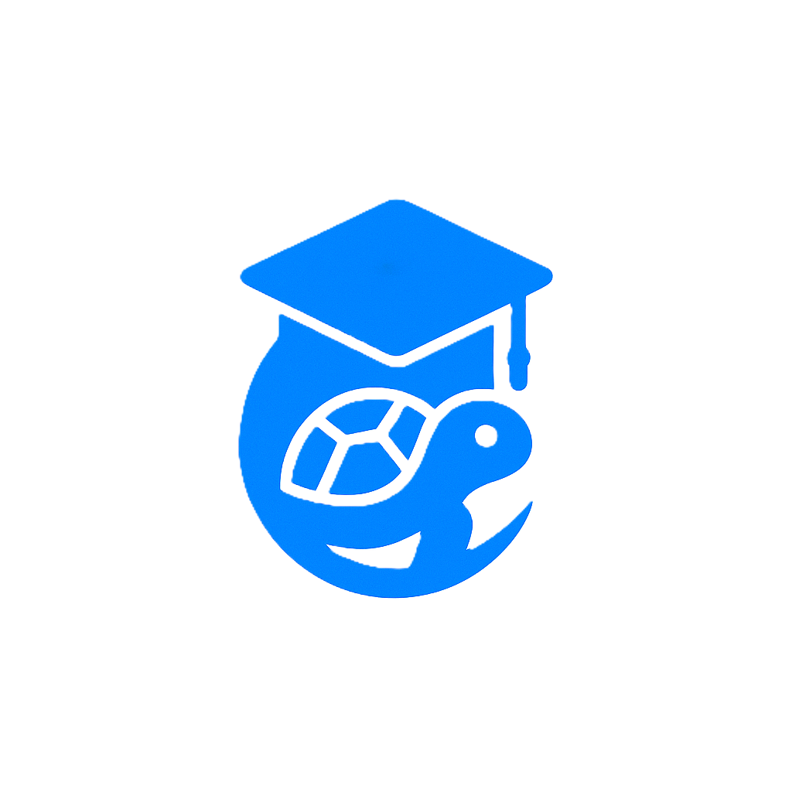

<div style="display: flex; align-items: center;">
  <h1 style="margin-left: 10px; color:rgb(0, 255, 200); font-family: 'Montserrat', sans-serif; font-weight: 700; text-transform: uppercase; letter-spacing: 3px; text-shadow: 3px 3px 6px rgba(0, 0, 0, 0.4);">
    GoLearnix
  </h1>
  
</div>

<br>

GoLearnix es una plataforma educativa tipo Udemy, diseñada para explorar buenas prácticas de desarrollo web moderno utilizando **arquitectura de microservicios**, con una clara separación de responsabilidades entre autenticación y gestión de cursos.

---

## Índice

- [Índice](#índice)
- [🚀 Tecnologías y Principios Utilizados](#-tecnologías-y-principios-utilizados)
  - [🏷️ Tecnologías](#️-tecnologías)
  - [🧱 Arquitecturas](#-arquitecturas)
  - [🧭 Principios](#-principios)
  - [🔁 Patrones de Diseño](#-patrones-de-diseño)
  - [✅ Buenas Prácticas](#-buenas-prácticas)
- [✨ Puntos Clave](#-puntos-clave)
- [🧰 Endpoints (Resumen)](#-endpoints-resumen)
  - [🔐 Servicio de Autenticación (Go)](#-servicio-de-autenticación-go)
  - [🎓 Servicio de Cursos (Java)](#-servicio-de-cursos-java)
    - [Cursos](#cursos)
    - [Inscripciones](#inscripciones)
    - [Progreso](#progreso)
    - [Reseñas](#reseñas)
    - [Categorías](#categorías)
- [📊 Base de Datos Auth (PostgreSQL)](#-base-de-datos-auth-postgresql)
- [📈 Base de Datos Course (PostgreSQL)](#-base-de-datos-course-postgresql)
- [🎉 Estado Actual](#-estado-actual)
- [💡 Futuras Mejoras](#-futuras-mejoras)
- [🔗 Diagrama de Arquitectura](#-diagrama-de-arquitectura)

---

## 🚀 Tecnologías y Principios Utilizados

### 🏷️ Tecnologías

    

### 🧱 Arquitecturas

  

### 🧭 Principios

   

### 🔁 Patrones de Diseño

   

### ✅ Buenas Prácticas

   

---

## ✨ Puntos Clave

- Los servicios de **auth y cursos son independientes**, cada uno con su propia base de datos.
- La autenticación se gestiona con JWT, y cada token incluye el rol del usuario.
- Los roles soportados son: `student`, `instructor`, `admin`.
- El acceso a endpoints está protegido según rol (ej: solo instructores pueden crear cursos).
- No se usan relaciones bidireccionales en las entidades JPA.

---

## 🧰 Endpoints (Resumen)

### 🔐 Servicio de Autenticación (Go)
| Método | Endpoint | Descripción | Código de estado |
|--------|----------|-------------|------------------|
| POST | `/auth/register` | Registro de usuario | 201 Created |
| POST | `/auth/login` | Login de usuario | 200 OK / 401 Unauthorized |
| POST | `/auth/logout` | Logout del usuario actual | 204 No Content |
| DELETE | `/auth/delete` | Eliminar cuenta del usuario actual | 204 No Content |

### 🎓 Servicio de Cursos (Java)

#### Cursos
| Método | Endpoint | Descripción | Código de estado |
|--------|----------|-------------|------------------|
| GET | `/courses` | Listar cursos públicos | 200 OK |
| GET | `/courses/{id}` | Ver detalle de un curso con secciones y reviews | 200 OK / 404 Not Found |
| POST | `/courses` | Crear un nuevo curso (instructor) | 201 Created / 403 Forbidden |
| PUT | `/courses/{id}` | Actualizar curso (instructor) | 200 OK / 403 Forbidden / 404 Not Found |
| DELETE | `/courses/{id}` | Eliminar curso (instructor o admin) | 204 No Content / 403 Forbidden / 404 Not Found |

#### Inscripciones
| Método | Endpoint | Descripción | Código de estado |
|--------|----------|-------------|------------------|
| GET | `/me/enrollments` | Ver cursos en los que está inscrito un usuario | 200 OK |
| POST | `/courses/{id}/enroll` | Inscribirse a un curso | 201 Created / 403 Forbidden |

#### Progreso
| Método | Endpoint | Descripción | Código de estado |
|--------|----------|-------------|------------------|
| GET | `/me/progress` | Ver progreso de lecciones | 200 OK |
| PUT | `/lessons/{id}/progress` | Marcar una lección como completada | 200 OK / 404 Not Found |

#### Reseñas
| Método | Endpoint | Descripción | Código de estado |
|--------|----------|-------------|------------------|
| GET | `/courses/{id}/reviews` | Ver reseñas de un curso | 200 OK |
| POST | `/courses/{id}/reviews` | Crear una reseña | 201 Created / 403 Forbidden |

#### Categorías
| Método | Endpoint | Descripción | Código de estado |
|--------|----------|-------------|------------------|
| GET | `/categories` | Listar categorías de cursos | 200 OK |
| POST | `/categories` | Crear nueva categoría (admin) | 201 Created / 403 Forbidden |

---

## 📊 Base de Datos Auth (PostgreSQL)

```sql
CREATE TYPE user_role AS ENUM ('admin', 'instructor', 'student');

CREATE TABLE users (
  id             UUID PRIMARY KEY DEFAULT uuid_generate_v4(),
  name           VARCHAR(100) NOT NULL,
  email          VARCHAR(255) UNIQUE NOT NULL,
  password_hash  TEXT NOT NULL,
  role           user_role NOT NULL DEFAULT 'student',
  created_at     TIMESTAMP WITH TIME ZONE DEFAULT now(),
  updated_at     TIMESTAMP WITH TIME ZONE DEFAULT now()
);

CREATE TABLE sessions (
  id          UUID PRIMARY KEY DEFAULT uuid_generate_v4(),
  user_id     UUID NOT NULL REFERENCES users(id) ON DELETE CASCADE,
  jwt_id      UUID NOT NULL UNIQUE,
  issued_at   TIMESTAMP WITH TIME ZONE NOT NULL,
  expires_at  TIMESTAMP WITH TIME ZONE NOT NULL
);
```

---

## 📈 Base de Datos Course (PostgreSQL)

```sql
CREATE TABLE course_categories (
  id          UUID PRIMARY KEY DEFAULT uuid_generate_v4(),
  name        VARCHAR(100) NOT NULL,
  description TEXT,
  created_at  TIMESTAMP WITH TIME ZONE DEFAULT now()
);

CREATE TABLE courses (
  id           UUID PRIMARY KEY DEFAULT uuid_generate_v4(),
  title        VARCHAR(200) NOT NULL,
  description  TEXT NOT NULL,
  category_id  UUID REFERENCES course_categories(id),
  instructor_id UUID NOT NULL,
  created_at   TIMESTAMP WITH TIME ZONE DEFAULT now(),
  updated_at   TIMESTAMP WITH TIME ZONE DEFAULT now()
);

CREATE TABLE sections (
  id         UUID PRIMARY KEY DEFAULT uuid_generate_v4(),
  course_id  UUID REFERENCES courses(id) ON DELETE CASCADE,
  title      VARCHAR(200) NOT NULL,
  "order"    INTEGER NOT NULL,
  created_at TIMESTAMP WITH TIME ZONE DEFAULT now()
);

CREATE TABLE lessons (
  id         UUID PRIMARY KEY DEFAULT uuid_generate_v4(),
  section_id UUID REFERENCES sections(id) ON DELETE CASCADE,
  title      VARCHAR(200) NOT NULL,
  content    TEXT NOT NULL,
  "order"    INTEGER NOT NULL,
  created_at TIMESTAMP WITH TIME ZONE

 DEFAULT now()
);

CREATE TABLE enrollments (
  id         UUID PRIMARY KEY DEFAULT uuid_generate_v4(),
  course_id  UUID REFERENCES courses(id) ON DELETE CASCADE,
  user_id    UUID NOT NULL,
  enrolled_at TIMESTAMP WITH TIME ZONE DEFAULT now()
);

CREATE TABLE progress (
  id         UUID PRIMARY KEY DEFAULT uuid_generate_v4(),
  lesson_id  UUID REFERENCES lessons(id) ON DELETE CASCADE,
  user_id    UUID NOT NULL,
  completed  BOOLEAN DEFAULT false,
  updated_at TIMESTAMP WITH TIME ZONE DEFAULT now()
);

CREATE TABLE reviews (
  id         UUID PRIMARY KEY DEFAULT uuid_generate_v4(),
  course_id  UUID REFERENCES courses(id) ON DELETE CASCADE,
  user_id    UUID NOT NULL,
  rating     INTEGER NOT NULL CHECK (rating BETWEEN 1 AND 5),
  comment    TEXT,
  created_at TIMESTAMP WITH TIME ZONE DEFAULT now()
);
```

---

## 🎉 Estado Actual
- [x] Definida la arquitectura
- [x] Diseño de bases de datos terminado
- [x] Definidos los endpoints
- [x] Rol y JWT configurados

---

## 💡 Futuras Mejoras
- Sistema de notificaciones o eventos
- Certificados digitales (u otros incentivos)
- Panel de administración
- Interfaz frontend (CLI, Web o ambos)
- Webhooks o mensajería para comunicación entre servicios

---

## 🔗 Diagrama de Arquitectura

```lua
                                      +---------------------------+
                                      |        Frontend           |
                                      +---------------------------+
                                                    |
                                                    v
                                      +---------------------------+
                                      |       API Gateway         |
                                      +---------------------------+
                                          /                \
                                         /                  \
                                        v                    v
                               +------------------+    +------------------+
                               |   Servicio Auth  |    |  Servicio Cursos |
                               +------------------+    +------------------+
                                        |                    |
                                        v                    v
                               +------------------+    +------------------+
                               |  Base de Datos   |    | Base de Datos    |
                               |     Auth DB      |    |   Courses DB     |
                               +------------------+    +------------------+

```

---

**GoLearnix** es mucho más que un proyecto educativo. Es una oportunidad para aplicar buenas prácticas reales en un sistema completo, escalable y profesional.

> "Aprende construyendo, construye aprendiendo."

---

